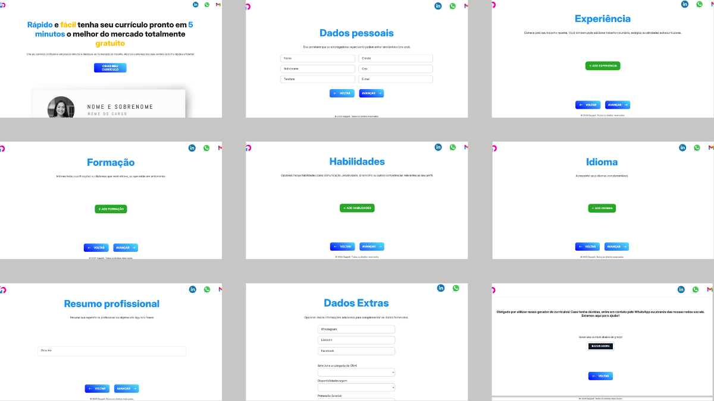
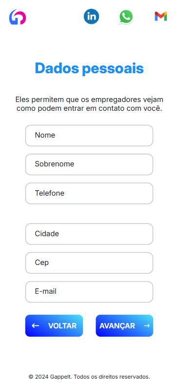
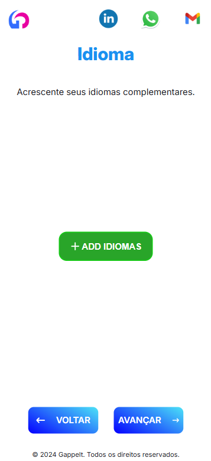
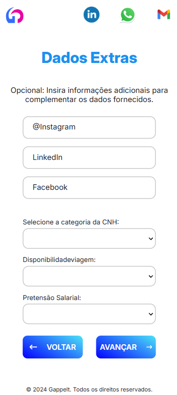
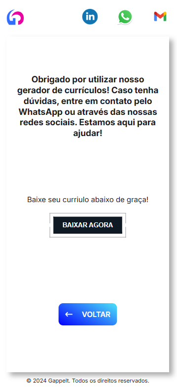

# Gerador de Currículo

## Gerador de Currículo Responsivo

Este repositório contém o código-fonte do **Gerador de Currículo**, uma aplicação desenvolvida em **React.js** que permite a criação rápida e fácil de currículos profissionais, totalmente responsivos e com opção de exportação em **PDF**.

🔗 [Acesse o projeto aqui](https://ghabriel-silva.github.io/gerador-cv/)

---

## 📸 Preview da Aplicação
Aqui está uma prévia do Gerador de Currículo em funcionamento:

### 🖥️ Versão Desktop

  
🔹 Visualização completa de todas as telas da versão desktop.

### 📱 Versão Mobile

| Exemplo 1 | Exemplo 2 | Exemplo 3 |
|-----------|-----------|-----------|
|  |  |  |
|  |  |  |
|  |  |  |

---

## 🚀 Começando
Essas instruções permitirão que você obtenha uma cópia do projeto em operação na sua máquina local para fins de desenvolvimento e teste.

Consulte **Implantação** para saber como implantar o projeto.

## 📋 Pré-requisitos
Antes de começar, certifique-se de ter os seguintes requisitos instalados:
- Node.js
- NPM ou Yarn
- Git

## 🔧 Instalação

1. Clone este repositório:
   ```bash
   git clone https://github.com/seuusuario/gerador-cv.git
   ```

2. Acesse o diretório do projeto:
   ```bash
   cd gerador-cv
   ```

3. Instale as dependências:
   ```bash
   npm install
   ```

## ⚙️ Executando o projeto
Para iniciar o servidor de desenvolvimento, execute:
```bash
npm start
```

## 📦 Implantação
Para implantar este projeto em um ambiente ativo, siga as instruções do provedor de hospedagem escolhido.

## 🛠️ Construído com
- React.js
- Styled Components
- PDFMaker

## ✒️ Autor
- **Gabriel Silva** - Desenvolvedor do projeto

## 📄 Licença
Este projeto está sob a licença MIT - veja o arquivo LICENSE para detalhes.

## 🎁 Expressões de gratidão
- Se você gostou do projeto, considere compartilhá-lo! 📢
- Feedbacks e sugestões são sempre bem-vindos! 🚀